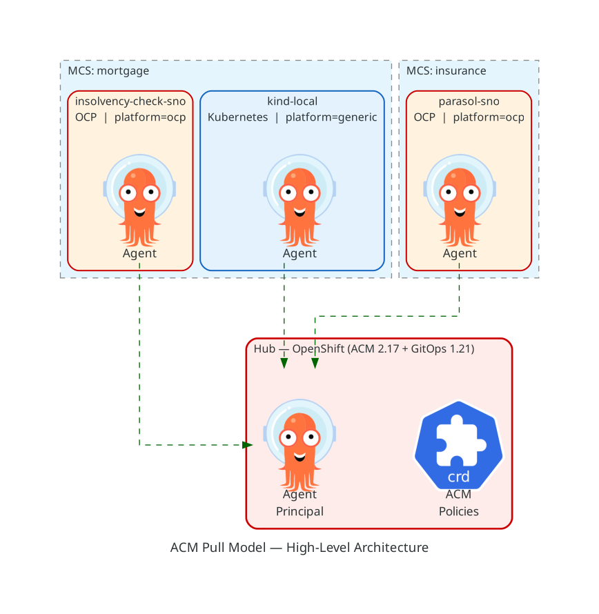
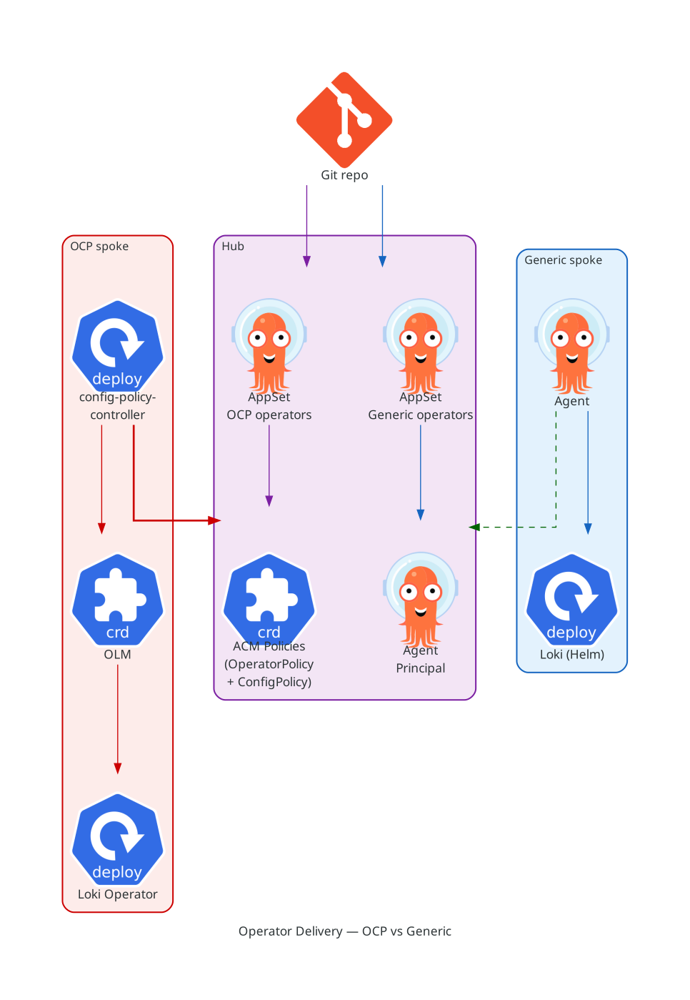
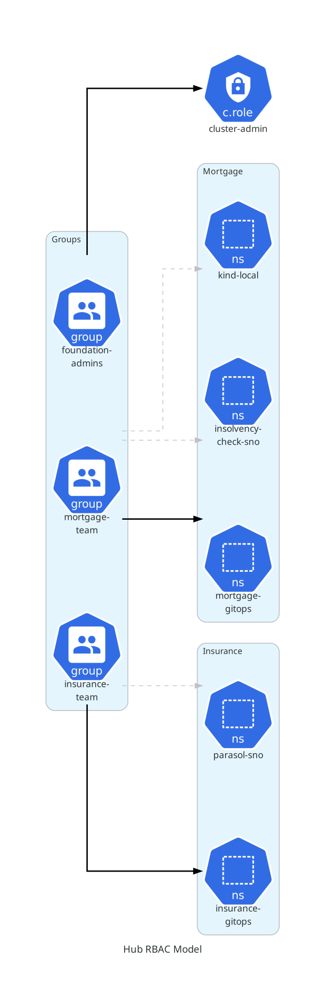
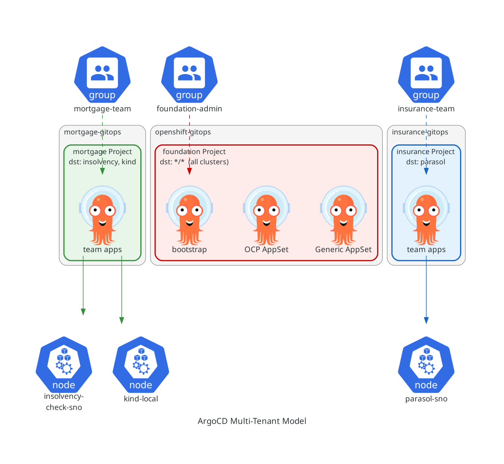

# ACM Pull Model with ArgoCD Agent — Heterogeneous Multi-Tenant Validation

## Use Case

Validate the **ACM advanced pull model (ArgoCD Agent)** in a scenario where:

- The **hub cluster** cannot reach the spoke clusters (hub → spoke is **blocked**)
- The **spoke clusters** can reach the hub (spoke → hub is **allowed**)
- The organization must support a **heterogeneous fleet** (OCP and non-OCP clusters).
  The heterogeneous requirement makes the **advanced pull model** mandatory — the
  base pull model only supports OCP clusters. Push model is not an option either,
  since the hub cannot reach the spokes.
- The organization follows a **layered structure**: a **foundation team** manages
  cross-cutting concerns (operators, security policies, baselines) on all clusters,
  while **business unit teams** (mortgage, insurance) independently manage their own
  applications and operators on a scoped subset of clusters.

This forces a **pure pull-based** architecture where all synchronization is initiated from the spoke side.

## Architecture



## Network Constraint

| Source | Destination | Allowed |
|--------|-------------|---------|
| insolvency-check-sno → Hub | API, ArgoCD Agent channel | Yes |
| parasol-sno → Hub | API, ArgoCD Agent channel | Yes |
| kind-local → Hub | API, ArgoCD Agent channel | Yes |
| Hub → insolvency-check-sno | Any | **No** |
| Hub → parasol-sno | Any | **No** |
| Hub → kind-local | Any | **No** (no route from cloud to local PC) |

This constraint makes the **push model impossible** and mandates:
- ArgoCD Agent on each spoke pulling application definitions from the hub
- ACM registration agent (klusterlet) initiating connections outbound from the spoke

## Heterogeneous Environment Emulation

The fleet includes both OCP and non-OCP clusters, distinguished by **labels**:

| Cluster | Platform | Label | Type |
|---------|----------|-------|------|
| insolvency-check-sno | OCP (SNO on AWS) | `platform=ocp` | Real OCP cluster |
| parasol-sno | OCP (SNO on AWS) | `platform=ocp` | Real OCP cluster |
| kind-local | Kind (local PC) | `platform=generic` | **Genuinely non-OCP** — proves Helm portability |

### Operator Delivery

The `platform` label determines the delivery mechanism, not just conditional
configuration. OLM and `OperatorPolicy` only exist on OCP, so the fleet
requires two paths:



| Path | Clusters | Mechanism | Who syncs |
|------|----------|-----------|-----------|
| **OCP** | `platform=ocp` | Helm library chart renders ACM `OperatorPolicy` + `ConfigurationPolicy` on the hub; ACM's `config-policy-controller` enforces them on spokes | Hub App Controller (ArgoCD) + ACM governance |
| **Generic** | `platform=generic` | Upstream community Helm chart deployed directly to spoke via ArgoCD Agent | Spoke App Controller (ArgoCD Agent) |

**Why this split**: `OperatorPolicy` is OLM-aware — it tracks the full
Subscription → InstallPlan → CSV → Deployment pipeline and reports compliance
to the ACM governance dashboard. Raw YAML cannot do this. On non-OCP clusters,
OLM doesn't exist, so operators are deployed as standard Helm releases.

A reusable **library chart** (`charts/acm-operator-policy/`) encapsulates the
Policy + PlacementBinding + optional Placement boilerplate. Each OCP operator
chart includes the library with a single `{{ include "acm-operator-policy.all" . }}`
line and adds operator-specific ConfigurationPolicies (e.g. `LokiStack`).

Two **ApplicationSets** auto-discover operators from the Git repo — no manual
Application YAML needed when onboarding new operators.

For the full rationale (OLM concepts, OperatorPolicy vs raw YAML, library chart
design, placement strategy, AppSet auto-discovery, onboarding steps), see
[docs/operator-delivery.md](docs/operator-delivery.md).

## Organizational Model

### Foundation Team

- **Scope**: all clusters in the fleet
- **ManagedClusterSet**: `global` (built-in — automatically contains every ManagedCluster)
- **Responsibilities**:
  - Foundation operators (logging, monitoring, cert-manager, service mesh, etc.)
  - Cluster-wide policies (security baselines, network policies, image policies)
  - Foundation namespaces are **protected** — teams cannot override them

### Business Unit Teams (Mortgage, Insurance)

- **Scope**: only their assigned clusters
- **ManagedClusterSet**: `mortgage` (insolvency-check-sno, kind-local), `insurance` (parasol-sno)
- **Responsibilities**:
  - Application-specific operators and workloads
  - Team-scoped policies within their namespaces
- **Constraints**:
  - Cannot create policies that target foundation-managed namespaces
  - Cannot modify or disable foundation operators
  - Cannot create policies with higher priority than foundation policies

## Technology Stack

| Component | Role |
|-----------|------|
| Red Hat ACM 2.17 | Hub multi-cluster management |
| ArgoCD Agent (Tech Preview) | Pull-based GitOps on spokes |
| Helm 3 | **Universal** operator & workload delivery on all clusters |
| Placement API | Cluster selection with label-based routing |
| ManagedClusterSets | Team isolation & RBAC boundaries |

## Running Notes

### 1. Configure imagePullSecret on the hub (required for non-OCP spokes)

By default, `MultiClusterHub` has **no `imagePullSecret`** configured. This means
ACM generates import manifests with an **empty** pull secret. On OCP spokes this is
harmless (the node's global pull secret covers `registry.redhat.io`), but on non-OCP
spokes (Kind, EKS, GKE, etc.) the klusterlet and addon pods fail with `ImagePullBackOff`.

Fix this **once** on the hub before importing any non-OCP cluster:

```bash
oc login $HUB_API -u $HUB_USER -p $HUB_PASS --insecure-skip-tls-verify

# Create a pull secret in the ACM namespace from your Red Hat pull secret
# Download from: https://console.redhat.com/openshift/install/pull-secret
oc create secret docker-registry multiclusterhub-operator-pull-secret \
  -n open-cluster-management \
  --from-file=.dockerconfigjson=pull-secret.txt
e
# Patch MultiClusterHub to reference it
oc patch multiclusterhub multiclusterhub -n open-cluster-management \
  --type=merge -p '{"spec":{"imagePullSecret":"multiclusterhub-operator-pull-secret"}}'
```

After this, all newly generated import secrets will embed valid credentials for
`registry.redhat.io`, `quay.io`, etc. Non-OCP spokes will pull images without
any manual workaround.


### 2. RBAC: users, groups, and team scoping (foundation-admin does this)

The hub RBAC model has three tiers:

| Tier | Group | Hub access | MCS scope | Can see clusters |
|------|-------|-----------|-----------|-----------------|
| Foundation | `foundation-admins` | `cluster-admin` | all (via `global`) | all |
| Mortgage | `mortgage-team` | namespace-scoped | `mortgage` only | insolvency-check-sno, kind-local |
| Insurance | `insurance-team` | namespace-scoped | `insurance` only | parasol-sno |



Legend: **solid arrow** = `admin` (full write), **dashed arrow** = `view` + `secret-reader` (read-only).

Each team gets three types of access on the hub:

| Binding | Namespace | Role | Why |
|---------|-----------|------|-----|
| `mortgage-team-admin` | `mortgage-gitops` | `admin` | Create ApplicationSets and manage team GitOps resources |
| `mortgage-team-mcs-view` | _(cluster-wide)_ | `managedclusterset:view:mortgage` | List clusters via `clusterview` API. ACM auto-propagates `ClusterRole/view` into each cluster namespace in the set |
| `mortgage-team-secret-reader` | `insolvency-check-sno`, `kind-local` | `secret-reader` (custom) | `get`/`list` secrets only — needed because `view` excludes secrets and teams must extract the `<cluster>-import` secret for spoke onboarding |

The same pattern applies to `insurance-team` with namespace `insurance-gitops` and cluster namespace `parasol-sno`.

Teams have **no access** to namespaces outside their scope — they cannot see `parasol-sno` secrets, cannot write to `openshift-gitops`, and cannot list `ManagedClusters` at cluster scope (they use `clusterview` instead).

#### Step 2a — Create htpasswd users (imperative — contains passwords)

```bash
oc login $HUB_API -u $HUB_USER -p $HUB_PASS --insecure-skip-tls-verify

htpasswd -cbB /tmp/hub-htpasswd foundation-admin 'foundation123'
htpasswd -bB /tmp/hub-htpasswd mortgage-user 'mortgage123'
htpasswd -bB /tmp/hub-htpasswd insurance-user 'insurance123'

oc create secret generic htpasswd-secret \
  --from-file=htpasswd=/tmp/hub-htpasswd \
  -n openshift-config
```

#### Step 2b — Add htpasswd identity provider

`01-oauth-htpasswd.yaml` is a **reference** — don't `oc apply` it directly because it
would overwrite the existing OAuth config (including any OpenID providers). Instead, patch:

```bash
oc patch oauth cluster --type=json -p '[{
  "op": "add",
  "path": "/spec/identityProviders/-",
  "value": {
    "name": "htpasswd",
    "mappingMethod": "claim",
    "type": "HTPasswd",
    "htpasswd": {
      "fileData": {
        "name": "htpasswd-secret"
      }
    }
  }
}]'
```

Wait ~30 seconds for the OAuth server pods to restart, then verify:

```bash
oc login $HUB_API -u foundation-admin -p 'foundation123' --insecure-skip-tls-verify
```

#### Step 2c — Apply declarative RBAC manifests

All remaining steps are pure YAML and can be applied in order:

```bash
oc login $HUB_API -u $HUB_USER -p $HUB_PASS --insecure-skip-tls-verify

# Groups
oc apply -f bootstrap/rbac/02-groups.yaml

# Foundation cluster-admin
oc apply -f bootstrap/rbac/03-foundation-cluster-admin.yaml

# Team namespaces
oc apply -f bootstrap/rbac/04-team-namespaces.yaml

# ManagedClusterSetBindings (must be applied after namespaces exist)
oc apply -f bootstrap/rbac/05-managedclustersetbindings.yaml

# Team role bindings (gitops namespace admin + MCS view)
oc apply -f bootstrap/rbac/06-team-rolebindings.yaml
```

> **Note**: `07-cluster-ns-secret-reader.yaml` is applied in step 3 — it
> references cluster namespaces that ACM creates when ManagedCluster resources
> are applied. For RBAC verification, see [step 5](#5-verify-rbac-scoping-after-import).

### 3. Apply bootstrap manifests on the hub (foundation-admin does this)

Foundation admin creates the ManagedClusterSets and registers the spoke clusters:

```bash
oc login $HUB_API -u foundation-admin -p 'foundation123' --insecure-skip-tls-verify

# ManagedClusterSets
oc apply -f bootstrap/managedclustersets/mortgage.yaml
oc apply -f bootstrap/managedclustersets/insurance.yaml

# ManagedCluster + KlusterletAddonConfig
oc apply -f bootstrap/import/insolvency-check-sno/managedcluster.yaml
oc apply -f bootstrap/import/parasol-sno/managedcluster.yaml
oc apply -f bootstrap/import/kind-local/managedcluster.yaml

# Now apply the secret-reader bindings (cluster namespaces exist after the above)
oc apply -f bootstrap/rbac/07-cluster-ns-secret-reader.yaml
```

> This completes RBAC setup from step 2c. For verification, see
> [step 5](#5-verify-rbac-scoping-after-import).

### 4. Team members: extract import secrets and apply on spokes

Each team member logs into the hub with their own credentials, reads the import
secret for their cluster, then applies it on the spoke using their cluster-admin
account.

This works because ACM creates the import secret in a namespace named after the
cluster (e.g. `insolvency-check-sno-import` in namespace `insolvency-check-sno`),
and the RBAC step above granted each team `view` + `secret-reader` on their
cluster namespaces (enough to `get` the secret, but not to modify anything).

#### Mortgage team imports their clusters

```bash
# Login to hub as mortgage-user
oc login $HUB_API -u mortgage-user -p 'mortgage123' --insecure-skip-tls-verify

# Extract import artifacts
for CLUSTER in insolvency-check-sno kind-local; do
  oc get secret -n $CLUSTER ${CLUSTER}-import -o jsonpath='{.data.crds\.yaml}' | base64 -d > /tmp/${CLUSTER}-crds.yaml
  oc get secret -n $CLUSTER ${CLUSTER}-import -o jsonpath='{.data.import\.yaml}' | base64 -d > /tmp/${CLUSTER}-import.yaml
done

# Apply on insolvency-check-sno (OCP — team has cluster-admin on this spoke)
oc login $INSOLVENCY_CHECK_SNO_API -u $INSOLVENCY_CHECK_SNO_USER -p $INSOLVENCY_CHECK_SNO_PASS --insecure-skip-tls-verify
oc apply -f /tmp/insolvency-check-sno-crds.yaml
oc apply -f /tmp/insolvency-check-sno-import.yaml

# Apply on kind-local (non-OCP — team has kubectl access)
kubectl --context kind-kind apply -f /tmp/kind-local-crds.yaml
kubectl --context kind-kind apply -f /tmp/kind-local-import.yaml
```

#### Insurance team imports their cluster

```bash
# Login to hub as insurance-user
oc login $HUB_API -u insurance-user -p 'insurance123' --insecure-skip-tls-verify

# Extract import artifacts
oc get secret -n parasol-sno parasol-sno-import -o jsonpath='{.data.crds\.yaml}' | base64 -d > /tmp/parasol-sno-crds.yaml
oc get secret -n parasol-sno parasol-sno-import -o jsonpath='{.data.import\.yaml}' | base64 -d > /tmp/parasol-sno-import.yaml

# Apply on parasol-sno (OCP — team has cluster-admin on this spoke)
oc login $PARASOL_SNO_API -u $PARASOL_SNO_USER -p $PARASOL_SNO_PASS --insecure-skip-tls-verify
oc apply -f /tmp/parasol-sno-crds.yaml
oc apply -f /tmp/parasol-sno-import.yaml
```

### 5. Verify RBAC scoping (after import)

> This step requires clusters to be imported (step 4) so that import secrets
> exist and `clusterview` returns results.
>
> **TODO**: automate as `scripts/verify-rbac.sh` using `oc auth can-i` assertions
> or a BATS test suite.

Scoped users cannot `oc get managedclusters` (cluster-scope list). ACM provides the
`clusterview` API that respects ManagedClusterSet boundaries:

```bash
# As mortgage-user: should see only mortgage clusters
oc login $HUB_API -u mortgage-user -p 'mortgage123' --insecure-skip-tls-verify
oc get managedclusters.clusterview.open-cluster-management.io
# Expected: insolvency-check-sno, kind-local

oc get managedclustersets.clusterview.open-cluster-management.io 
# Expected: mortgage

# Should be able to read import secret
oc get secret insolvency-check-sno-import -n insolvency-check-sno

# Should NOT see insurance clusters or secrets
oc get secret parasol-sno-import -n parasol-sno
# Expected: Forbidden

# As insurance-user: should see only insurance clusters
oc login $HUB_API -u insurance-user -p 'insurance123' --insecure-skip-tls-verify
oc get managedclusters.clusterview.open-cluster-management.io
# Expected: parasol-sno

oc get managedclustersets.clusterview.open-cluster-management.io
# Expected: insurance
```

### 6. Non-OCP spokes: manual pull secret (fallback)

> **Note**: this section is only needed if step 1 (`imagePullSecret` on
> `MultiClusterHub`) was **not** done before importing the cluster.
> If step 1 was done correctly, skip this entirely.

If the import manifests contain an empty pull secret (because `MultiClusterHub`
had no `imagePullSecret` at import time), you can fix it retroactively:

1. **Fix the root cause on the hub** (step 1), then
2. **Force ACM to regenerate the import secret** with valid credentials:

```bash
# Delete the stale import secret — ACM regenerates it within ~15s
oc delete secret kind-local-import -n kind-local

# Wait, re-extract, and re-apply on the spoke (same procedure as step 4)
oc get secret -n kind-local kind-local-import -o jsonpath='{.data.crds\.yaml}' | base64 -d > /tmp/kind-local-crds.yaml
oc get secret -n kind-local kind-local-import -o jsonpath='{.data.import\.yaml}' | base64 -d > /tmp/kind-local-import.yaml
kubectl --context kind-kind apply -f /tmp/kind-local-crds.yaml
kubectl --context kind-kind apply -f /tmp/kind-local-import.yaml
```

This replaces the old klusterlet credentials with ones that include valid
`registry.redhat.io` pull credentials. All pods will restart and pull images
successfully.

Repeat for **every non-OCP cluster** — replace `kind-local` and `kind-kind` with
the appropriate cluster name and kubectl context. OCP clusters don't need this
because the node's global pull secret already covers `registry.redhat.io`.

### 7. ArgoCD Agent setup (foundation-admin does this)

The ArgoCD Agent (Technology Preview) implements the **advanced pull model**: a principal
runs on the hub and agents run on each spoke. Spokes pull application definitions from
the hub over mTLS — no hub-to-spoke connectivity required.

#### Architecture



The hub runs in **hybrid mode** (`controller.enabled: true`):

- **Agent Principal** receives mTLS connections from spoke agents and routes
  Applications to the correct agent based on `destination.name`.
- **Hub App Controller** reconciles hub-targeted Applications (e.g.
  `foundation-bootstrap`, `loki-ocp` which deploy ACM policies to the hub).
  Agent-managed cluster secrets are annotated with
  `argocd.argoproj.io/skip-reconcile: "true"` (via `07-skip-reconcile-policy.yaml`)
  so the hub controller ignores them — the spoke agents handle those Applications.
- **ApplicationSets** auto-discover operators from Git: `foundation-ocp-operators`
  generates hub-targeted apps (rendered as ACM Policies), `foundation-generic-operators`
  generates agent-routed apps (deployed directly on spokes via upstream Helm).
- **AppProjects** (`foundation`, `mortgage`, `insurance`) are propagated to every
  spoke agent, which enforces destination and source restrictions locally.

Each spoke has its own **App Controller** (sync happens locally — the hub only
defines *what* to deploy, the spoke decides *when* and *how*) and **Repo Server**
(clones Git repos and renders Helm charts locally — a key difference from push
mode where the hub does the rendering).

#### Spoke-side service accounts and privileges

Neither ArgoCD nor ACM on the hub has credentials to the spoke clusters. Both
paths are pull-based: spoke-side agents initiate the connection, download their
work items, and apply them locally with their own service accounts.

ACM deploys the same RBAC structure on every spoke (OCP and non-OCP alike):

| Component | Who initiates | Spoke SA | Privileges |
|-----------|--------------|----------|------------|
| ArgoCD Agent | Spoke → hub principal (mTLS) | `acm-openshift-gitops-agent-agent` | Minimal: `applications` CRUD + `namespaces` list |
| ArgoCD App Controller | _(local, no connection)_ | `acm-openshift-gitops-argocd-application-controller` | Read-only cluster-wide + write in `openshift-gitops` only (see details below) |
| ACM config-policy-controller | Klusterlet → hub (client cert) | `config-policy-controller-sa` | `["*"]["*"]["*"]` — full cluster access |
| ACM governance-policy-framework | Klusterlet → hub (client cert) | `governance-policy-framework-sa` | Scoped (see below) |

**No hub → spoke credentials exist.** On the hub, ArgoCD cluster secrets point
to the local principal resource proxy (`svc:9090?agentName=<cluster>`), not to
spoke API servers.

##### ArgoCD Agent

Only pulls Application specs from the hub and writes them as local Application
CRs. Minimal RBAC — cluster-wide namespace listing and ArgoCD Application CRUD.

##### ArgoCD App Controller — the RBAC gap

The App Controller has **two layers** of RBAC deployed by ACM:

**ClusterRole** (cluster-wide):

| apiGroups | resources | verbs | Notes |
|-----------|-----------|-------|-------|
| `*` | `*` | `get, list, watch` | Read-only for everything |
| `operators.coreos.com` | `*` | `*` | OLM (only exists on OCP) |
| `operator.openshift.io`, `config.openshift.io`, `console.openshift.io`, `user.openshift.io` | `*` | `*` | OCP-specific groups |
| `""` | `namespaces, PVCs, PVs, configmaps` | `*` | Infrastructure primitives |
| `rbac.authorization.k8s.io` | `*` | `*` | RBAC management |
| `storage.k8s.io` | `*` | `*` | Storage |

**Namespace Role** (only in `openshift-gitops`):

| apiGroups | resources | verbs |
|-----------|-----------|-------|
| `apps` | `deployments, statefulsets, daemonsets, replicasets` | full CRUD |
| `""` | `services, serviceaccounts, configmaps, secrets, pods` | full CRUD |
| `batch` | `jobs, cronjobs` | full CRUD |
| `networking.k8s.io` | `ingresses, networkpolicies` | full CRUD |
| `argoproj.io` | `applications, appprojects, argocds` | `*` |

**The gap**: the controller can create Deployments, Services, etc. **only in
`openshift-gitops`**. It cannot write workload resources in other namespaces
(e.g. `loki`).
To fix this,
we deploy a supplemental ClusterRole via a ConfigurationPolicy
(`08-agent-controller-rbac-policy.yaml`) that grants write access for
workload resources cluster-wide (can be more restrictive). The ACM addon manager reverts changes to
its own ClusterRole, so the supplemental role must be a separate resource.

##### config-policy-controller

Full cluster access (`["*"]["*"]["*"]`) because it enforces ConfigurationPolicy
and OperatorPolicy — it must be able to create/modify arbitrary resources
(Subscriptions, CRDs, Deployments, etc.).

##### governance-policy-framework

The orchestrator — it watches policies, evaluates compliance, and delegates
enforcement to specialized controllers (`config-policy-controller`,
`cert-policy-controller`). It does not apply arbitrary resources itself, so
its RBAC is deliberately scoped:

| Binding | Scope | Permissions |
|---------|-------|-------------|
| ClusterRole `open-cluster-management:governance-policy-framework` | Cluster-wide | Read webhooks, CRDs; CRUD Gatekeeper constraints/templates; get/patch deployments |
| Role in `<cluster>` NS (e.g. `kind-local`) | Namespace | CRUD on `policy.open-cluster-management.io/*`, events, secrets |
| Role `governance-policy-framework-leader` | `open-cluster-management-agent-addon` | Leader election (leases, events) |

##### Verification (run on a spoke)

```bash
# ArgoCD Agent SA (minimal — only apps + namespaces)
oc get clusterrole acm-openshift-gitops-openshift-gitops-agent-agent \
  -o jsonpath='{range .rules[*]}{.apiGroups} {.resources} {.verbs}{"\n"}{end}'

# ArgoCD App Controller — ClusterRole (read-only for most resources)
oc get clusterrole acm-openshift-gitops-openshift-gitops-argocd-application-controller \
  -o jsonpath='{range .rules[*]}{.apiGroups} {.resources} {.verbs}{"\n"}{end}'

# ArgoCD App Controller — Namespace Role (write only in openshift-gitops)
oc get role acm-openshift-gitops-argocd-application-controller -n openshift-gitops \
  -o jsonpath='{range .rules[*]}{.apiGroups} {.resources} {.verbs}{"\n"}{end}'

# config-policy-controller (full cluster access)
oc get clusterrole open-cluster-management:config-policy-controller \
  -o jsonpath='{.rules[0].apiGroups} {.rules[0].resources} {.rules[0].verbs}'
# Expected: ["*"] ["*"] ["*"]

# governance-policy-framework (scoped — orchestrator only)
oc get clusterrolebinding -o wide | grep governance-policy
oc get rolebinding -A -o wide | grep governance-policy

# Hub: confirm cluster secrets point to local proxy, not to spoke APIs
oc get secrets -n openshift-gitops \
  -l argocd.argoproj.io/secret-type=cluster \
  -o jsonpath='{range .items[*]}{.metadata.name}{"\t"}{.data.server | @base64d}{"\n"}{end}'
```

#### Per-team AppProjects

Instead of a single wildcard `default` AppProject, we create per-team projects
for isolation at the ArgoCD level (in addition to ACM ManagedClusterSet scoping):

| AppProject | `sourceNamespaces` | Destinations | Purpose |
|------------|-------------------|--------------|---------|
| `default` | _(locked — empty)_ | _(empty)_ | Prevents accidental use |
| `foundation` | `openshift-gitops` | `*/*` (all clusters, all namespaces) | Foundation operators & policies |
| `mortgage` | `mortgage-gitops` | `insolvency-check-sno/*`, `kind-local/*` | Mortgage team apps |
| `insurance` | `insurance-gitops` | `parasol-sno/*` | Insurance team apps |

Teams create ApplicationSets in their own namespace (`mortgage-gitops`, `insurance-gitops`)
referencing their team's AppProject. The principal propagates the project to spoke agents,
which enforce destination restrictions locally.

#### Step 7a — Install OpenShift GitOps operator

```bash
oc login $HUB_API -u foundation-admin -p 'foundation123' --insecure-skip-tls-verify
oc apply -f bootstrap/argocd-agent/01-gitops-subscription.yaml
```

Wait for the CSV to reach `Succeeded` and the default ArgoCD CR to be created:

```bash
oc get csv -n openshift-gitops-operator
# Expected: openshift-gitops-operator.vX.Y.Z   Succeeded

oc get argocd -n openshift-gitops
# Expected: openshift-gitops
```

> **Note**: the Subscription already includes the three env vars required for
> Agent mode (`ARGOCD_CLUSTER_CONFIG_NAMESPACES`, `ARGOCD_PRINCIPAL_TLS_SERVER_ALLOW_GENERATE`,
> `ARGOCD_PRINCIPAL_REDIS_SERVER_ADDRESS`).

> **Alternative**: you can install the GitOps operator from the OCP console
> (OperatorHub → Red Hat OpenShift GitOps → Install), but you will then need to
> manually patch the Subscription to add the Agent env vars. The CLI approach
> with `01-gitops-subscription.yaml` includes everything in one step.
>
> Ref: [Installing GitOps Operator](https://docs.redhat.com/en/documentation/red_hat_openshift_gitops/1.21/html-single/installing_gitops/index)
> Ref: [Configuring subscriptions and resources for Argo CD agent](https://docs.redhat.com/en/documentation/red_hat_advanced_cluster_management_for_kubernetes/2.17/html-single/gitops/index#configure-subs-resources-gitops)


#### Step 7b — Replace ArgoCD CR with Agent mode

```bash
oc apply -f bootstrap/argocd-agent/02-argocd-agent.yaml
```

This disables the traditional ArgoCD controller and enables the **agent principal**
with mTLS authentication and an OpenShift Route for spoke connectivity.

The principal pod will CrashLoopBackOff until step 7d creates the TLS certificates.

> Ref: [Configuring subscriptions and resources for Argo CD agent](https://docs.redhat.com/en/documentation/red_hat_advanced_cluster_management_for_kubernetes/2.17/html-single/gitops/index#configure-subs-resources-gitops)

#### Step 7c — Apply per-team AppProjects

```bash
oc apply -f bootstrap/argocd-agent/03-appproject.yaml
```

#### Step 7d — Enable GitOps addon with Agent on all spokes

```bash
# Bind global MCS to openshift-gitops (so Placement can find all clusters)
oc apply -f bootstrap/argocd-agent/04-mcsb-global.yaml

# Placement: selects all managed clusters except local-cluster
oc apply -f bootstrap/argocd-agent/05-placement.yaml

# GitOpsCluster: enables addon + ArgoCD Agent
oc apply -f bootstrap/argocd-agent/06-gitopscluster.yaml
```

The `GitOpsCluster` controller will:
1. Generate TLS certificates (CA, principal cert with Route hostname in SANs, client certs)
2. Create `ManagedClusterAddOn` for each spoke
3. Deploy the ArgoCD Agent + GitOps operator on each spoke (OLM on OCP, embedded Helm on non-OCP)
4. Propagate the CA certificate via ManifestWork
5. Auto-heal the agent image to match the principal (from the GitOps operator CSV)

> Ref: [Enabling GitOps addon with ArgoCD Agent](https://docs.redhat.com/en/documentation/red_hat_advanced_cluster_management_for_kubernetes/2.17/html-single/gitops/index#enabling-gitops-addon-argocd-agent)

#### Step 7e — Verify

> **TODO**: automate as `scripts/verify-agent.sh` alongside the RBAC tests.

```bash
# Principal pod running on hub
oc get pods -n openshift-gitops -l app.kubernetes.io/name=openshift-gitops-agent-principal
# Expected: 1/1 Running

# GitOpsCluster conditions all healthy
oc get gitopscluster gitops-agent-clusters -n openshift-gitops \
  -o jsonpath='{.status.conditions[?(@.type=="Ready")].status}'
# Expected: True

# Agent pods running on each spoke
oc get managedclusteraddon gitops-addon -n insolvency-check-sno \
  -o jsonpath='{.status.conditions[?(@.type=="Available")].status}'
# Expected: True  (repeat for parasol-sno, kind-local)
```

> **ArgoCD UI note**: in the ArgoCD web console, spoke clusters will appear in
> Settings → Clusters but **without a connection status or version** — only
> `in-cluster` shows "Successful". This is expected in Agent mode: the hub
> doesn't probe spokes (there is no hub→spoke path). The agent on each spoke
> pulls from the principal; actual connectivity is confirmed by
> `ManagedClusterAddOn Available: True` and by successful Application syncs.


